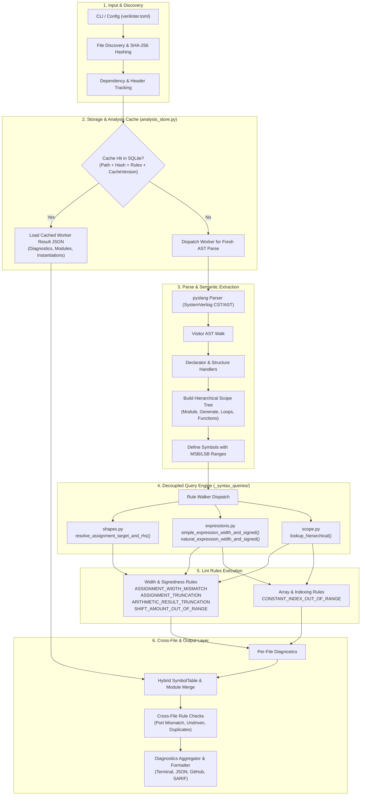
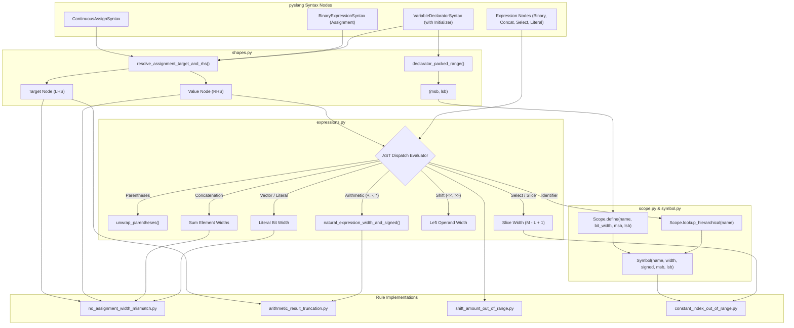
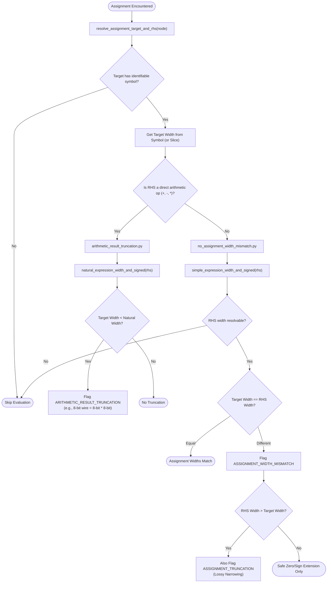
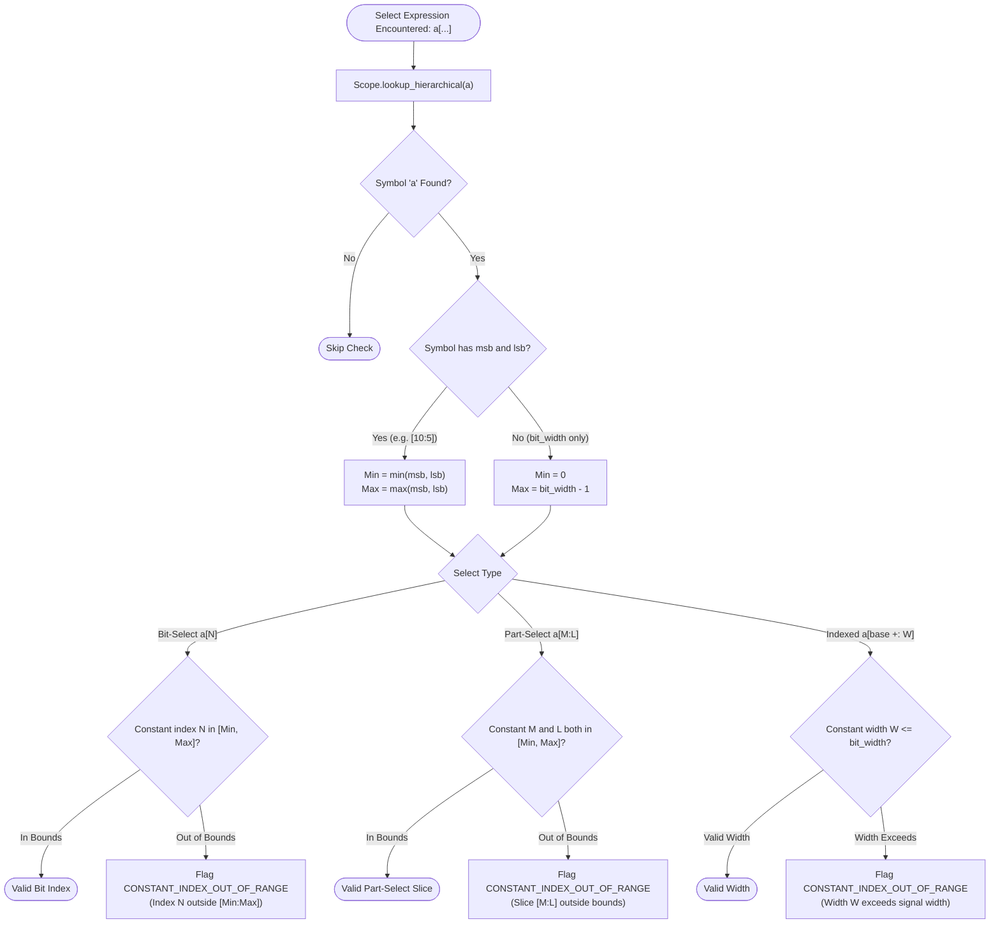
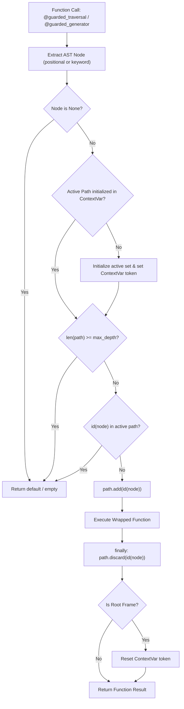

# Verilinter Architecture & Expression/Assignment Analysis

This document details the system architecture of Verilinter, the decoupled AST query engine, and the dedicated architectural subsystems for evaluating expressions and assignments in Verilog and SystemVerilog.

---

## 1. High-Level System Pipeline



---

## 2. Decoupled Expression & Shape Resolution Architecture



---

## 3. Assignment Width & Truncation Evaluation Flow



---

## 4. Constant Index Out of Range Verification Flow



---

## 5. Why Assignments and Expressions Require Dedicated Subsystem Architecture

In Verilog and SystemVerilog (IEEE 1800-2017), expressions and assignments are not simple localized syntactic tokens; they obey complex semantic typing and context-dependent width rules. Treating them as ad-hoc logic inside individual rule classes creates subtle defects and maintenance bottlenecks:

### A. Context-Determined vs. Self-Determined Widths
- In Verilog, binary shift operations (`<<`, `>>`, `<<<`, `>>>`) are **self-determined**: their resulting bit width is strictly equal to the bit width of the left operand, completely ignoring the right-hand shift amount or the surrounding assignment context.
- Conversely, binary arithmetic operations (`+`, `-`, `*`) are **context-determined**: when assigned to an LHS target or used in larger expressions, their bit width expands to match the largest operand or the target width.
- When an individual rule attempts to evaluate an expression width on its own, it easily conflates self-determined width with natural/contextual width, causing either false positives (e.g. flagging a valid sign-extension) or false negatives (e.g. missing product overflow).
- **Architecture Solution**: A single query layer (`expressions.py`) explicitly distinguishes `simple_expression_width_and_signed` (which only resolves self-determined, invariant widths) from `natural_expression_width_and_signed` (which models operation-specific bit-growth).

### B. Multiple Value-Transfer Shapes (LHS & RHS)
Value transfer occurs across three fundamentally different syntax nodes:
1. Continuous assignments: `ContinuousAssignSyntax` (`assign a = b;`)
2. Procedural assignments: `BinaryExpressionSyntax` (`a <= b;`, `a = b;`)
3. Variable declarator initializers: `VariableDeclaratorSyntax` (`wire [7:0] p = a * b;`)

Furthermore, the target (LHS) can take multiple structural shapes:
- Simple identifier: `a = ...`
- Bit-select / part-select: `a[3:0] = ...`
- Indexed part-select: `a[idx +: 4] = ...`
- Concatenation / destructuring assignment: `{a, b} = ...`
- Struct / interface member select: `bundle.valid = ...`

When each lint rule parses these syntax patterns independently, coverage gaps inevitably occur (e.g. a width rule that checks continuous and procedural assignments but misses declarator initializers).
- **Architecture Solution**: `shapes.resolve_assignment_target_and_rhs` standardizes the extraction of target and RHS across all syntactic constructs, providing a single point of enforcement.

### C. Non-Zero and Descending Vector Bounds
RTL designs frequently declare buses with non-zero or ascending ranges:
```systemverilog
wire [10:5] x;
wire [0:7]  y;
```
If the semantic model only records scalar `bit_width = 6`, rules checking constant indexing (`x[6]`) will incorrectly flag valid indices as out-of-bounds (assuming `[5:0]`).
- **Architecture Solution**: `Symbol` carries explicit `msb` and `lsb` alongside `bit_width`, populated during AST declarator walking and serialized through the SQLite store.

### D. Lexical Scope vs. Upward Resolution
Complex RTL constructs (such as `generate for` loops, unrolled procedural loops, and automatic functions) nest scopes. When rules evaluate expressions inside a child scope, looking only at the immediate scope fails to find module-level nets.
- **Architecture Solution**: `Scope.lookup_hierarchical` traverses the parent pointer chain, resolving outer declarations while preserving inner shadowing.

---

## 7. Dependency Injection & Modular Subcomponent Architecture

Verilinter employs dependency injection (DI) across its analysis pipeline, walker, and AST handlers to enable isolated testing, mock backends, and decoupled extension:

### A. Pipeline & Storage Dependency Injection (`engine.py`)
`LintPipeline` accepts optional dependency injection in its constructor:
- `rule_runner`: Custom or filtered `RuleRunner` instance for syntax AST rules.
- `symbol_rule_runner`: Custom `SymbolRuleRunner` instance for per-file symbol table rules.
- `module_rule_runner`: Custom `ModuleRuleRunner` instance for cross-file module rules.
- `store`: Custom `AnalysisStore` or mock storage backend, decoupling analysis runs from physical SQLite database creation during unit tests.

Injected runners are executed identically across in-memory syntax trees (`analyze_trees`) and on-disk files (`analyze_paths`).

### B. AST Walker Decoupling (`walker.py`)
`Walker` accepts injectable:
- `dispatch`: Custom `Dispatch` registry for routing AST nodes to handlers without modifying the global dispatch table.
- `vnode_factory`: Custom node factory/wrapper, allowing mock vnode generation in unit tests without module monkeypatching.

### C. Handler Subcomponent Decomposition (`handlers/`)
Complex AST handlers decompose disparate concerns into injectable strategy subcomponents:
- **`IdentifierNameHandler`**:
  - `StructuralReferenceFilter`: Configurable predicates to filter non-referential identifier tokens.
  - `SymbolResolver`: Resolves or synthesizes symbols across lexical/package scopes, with injectable `qualifier_fn`.
  - `UseEventContextExtractor`: Extracts access modes, driver blocks, and branch exclusivity signatures.
- **`HierarchyInstantiationHandler`**:
  - `ParameterOverrideExtractor`: Extracts parameter overrides and computes style, accepting an injectable constant `evaluator`.
  - `PortConnectionExtractor`: Resolves port connections and connection style, accepting an injectable `width_resolver`.

---

## 8. AST Traversal Guard & Active-Path Cycle Immunity Subsystem

To guarantee complete loop immunity, bound recursion depths, and eliminate manual boilerplate across AST query functions, Verilinter introduces the `TraversalGuard` subsystem (`traversal_guard.py`).

### A. The Challenge: PyBind11 Wrapper Address Recycling vs. Cycle Detection

When analyzing syntax trees with `pyslang`, the Python wrapper `pyslang.SyntaxNode` and token objects are created dynamically on the fly across PyBind11 C++/Python boundaries.

```
       [Parent Node]
       /           \
[Child 1: PyObject 0x1000]   [Child 2: PyObject 0x1000]
(enters, exits, garbage collected) -> (allocated at recycled address 0x1000!)
```

1. **Address Recycling Hazard**:
   - If a traversal keeps a flat set of visited integer IDs (`visited: set[int] = set()`) and leaves IDs in the set across sibling iterations, a critical failure occurs.
   - Child 1 is processed; when it goes out of scope, Python frees its memory address (e.g. `0x1000`).
   - CPython's `pymalloc` memory pool immediately allocates the exact same address `0x1000` to Child 2's Python wrapper.
   - If Child 1's ID was retained in a flat set, Child 2 is spuriously identified as a "cycle" and skipped, leading to false negatives and broken lint analyses.
2. **Active-Path Invariance**:
   - Instead of a flat persistent visited set, the traversal must track only the **active path** (nodes currently living on the active call stack frames).
   - An active parent or ancestor node wrapper is guaranteed alive and anchored on the stack, meaning its memory address can *never* be recycled for any of its children or descendants during its descent.
   - When a stack frame unwinds, its ID is discarded immediately. Subsequent siblings may reuse that address safely without false-positive collision.

### B. Core Architecture: `ActivePath`, `@guarded_traversal`, and `@guarded_generator`

The `traversal_guard.py` module encapsulates active-path tracking into reusable primitives:



1. **`ActivePath` & `ActivePathScope`**:
   - RAII context manager for explicit scoping:
     ```python
     path = ActivePath(max_depth=64)
     with path.enter(node) as scope:
         if not scope:
             return None
         # Traverse children with path.next_level()
     ```
2. **`@guarded_traversal(max_depth=64, default=None, node_arg=0)`**:
   - Decorator for recursive AST value functions.
   - Uses `ContextVar` to keep independent active paths per traversal entry point.
   - Pre-computes parameter extraction at decoration time for near-zero runtime overhead.
   - Supports custom `node_arg` names (`node_arg="expr"`) or parameter indices (`node_arg=1`).
3. **`@guarded_generator(max_depth=128, node_arg=0)`**:
   - Decorator for recursive generator traversals (`yield` and `yield from`).
   - Guarantees unwinding via `try...finally: path.discard(nid)` even on early generator termination (e.g. `break` in consumer loop).
4. **`ast_descendants_iter(root, stop_at=None, max_depth=128)`**:
   - Iterative DFS walker using an explicit stack, eliminating call-stack recursion entirely while enforcing active-path cycle protection and depth bounds.

### C. Standardized Integration Across Query Modules

All syntax query modules in `src/pkg/parser/_syntax_queries/` use the `TraversalGuard` subsystem:

| Query Function | Subsystem Primitive | Max Depth | Default Return |
| :--- | :--- | :--- | :--- |
| `contains_descendant` (`access.py`) | `@guarded_traversal` | 64 | `False` |
| `_selectors_containing_identifier` (`access.py`) | `@guarded_traversal` | 32 | `[]` |
| `_statement_assigns_register` (`access.py`) | `@guarded_traversal` | 64 | `False` |
| `is_state_register_reset_covered` (`access.py`) | `@guarded_traversal` | 64 | `False` |
| `_iter_ansi_ports` (`declarators.py`) | `@guarded_generator` | 32 | `Iterator[object]` |
| `iter_identifier_reads` (`procedural.py`) | `@guarded_generator` | 128 | `Iterator[tuple[str, SyntaxNode]]` |
| `_iter_identifier_nodes` (`procedural.py`) | `@guarded_generator` | 128 | `Iterator[tuple[str, SyntaxNode]]` |
| `iter_assignment_nodes` (`procedural.py`) | `@guarded_generator` | 128 | `Iterator[SyntaxNode]` |
| `_collect_sensitivity_events` (`procedural.py`) | `@guarded_traversal` | 64 | `None` |
| `_count_edge_qualified_signals` (`procedural.py`) | `@guarded_traversal` | 32 | `None` |
| `_edge_qualified_signal_names` (`procedural.py`) | `@guarded_traversal` | 32 | `None` |
| `async_reset_signal_edges` (`procedural.py`) | `@guarded_traversal` | 32 | `None` |
| `procedural_block_edge_events` (`procedural.py`) | `@guarded_traversal` | 32 | `None` |
| `extract_assignment_target_and_selectors` (`shapes.py`) | `@guarded_traversal` | 64 | `(None, [])` |
| `resolve_assignment_target` (`shapes.py`) | `@guarded_traversal` | 32 | `None` |
| `evaluate_constant_expression` (`expressions.py`) | `@guarded_traversal` | 16 | `None` |
| `simple_expression_width_and_signed` (`expressions.py`) | `@guarded_traversal` (`node_arg="expr"`) | 32 | `(None, None)` |


